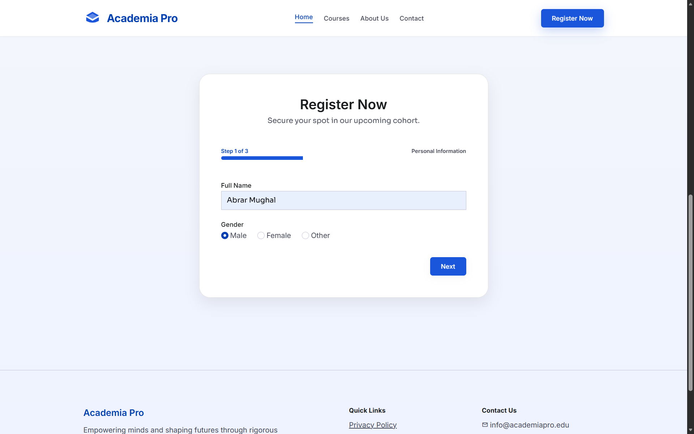
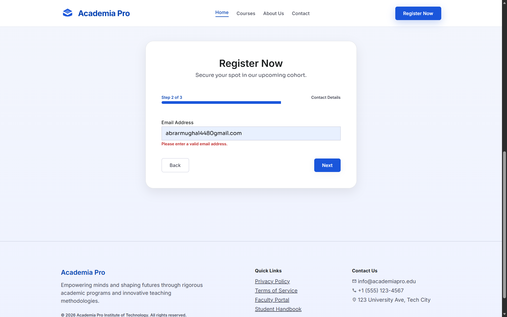
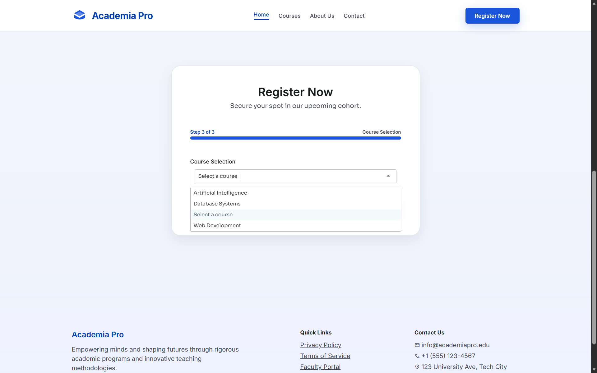
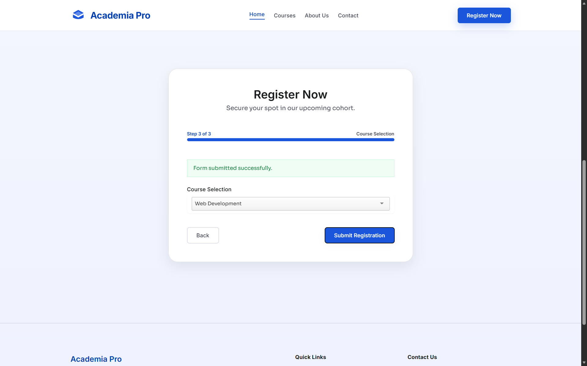

# Academia Pro Institute Website

A modern, single-page academic landing page for **Academia Pro Institute of Technology**. The site presents the institute branding, course highlights, and a 3-step registration flow with animated transitions and a polished glassmorphism-style UI.

## Project Overview

This project is built with plain **HTML**, **CSS**, and **JavaScript**, with styling powered by **Tailwind CSS via CDN** and a small custom Tailwind config. It also uses:

- **Inter** and **Sora** fonts from Google Fonts
- **Material Symbols Outlined** for icons
- **Tom Select** for the course dropdown enhancement

## Main Screens

### 1. Home / Hero Section

The top section introduces the institute with the headline **“Empowering Minds, Shaping Futures”** and two primary actions:

- **Register Now** to jump to the registration form
- **Explore Courses** to jump to the courses section

### 2. Courses Section

This section shows three featured programs:

- Web Development
- Artificial Intelligence
- Database Systems

Each card includes an icon, short description, and a learn-more action.

### 3. Registration Section

The registration area is a **3-step wizard**:

1. Personal Information
2. Contact Details
3. Course Selection

The form shows a progress bar, the current step name, and navigation buttons for moving back and forth.

### 4. Footer

The footer contains the institute summary and quick links such as Privacy Policy, Terms of Service, and Faculty Portal.

## Screenshots

The following screenshots are included in the `images` folder and document the main states of the site.

### Landing Page

### Step 1: Personal Information

### Step 2: Email Validation Error

### Step 3: Course Selection

### Submission Success

## Form Behavior

- The **Next** button moves between steps.
- The **Back** button returns to the previous step.
- The **Submit Registration** button is shown only on the final step.
- On successful submission, a green success message appears at the top of the form and the page scrolls back to the registration area.

## Error Handling / Error Screens

Current behavior is simple and important to know:

- There is **no separate full-page error screen**.
- The only visible error-related UI in the current build is the hidden inline email message:
  - **“Please enter a valid email address.”**
- That email error message is present in the markup, but the current JavaScript does **not** actively show or hide it yet.
- The form buttons are handled with JavaScript, so the browser is not currently doing a full form submit validation flow.

In short, the app currently has a **success state**, but the **error state is mostly a placeholder** for future validation logic.

## Features

- Responsive layout for desktop and mobile
- Smooth section reveal animations
- Card hover motion and soft shadow depth
- Multi-step registration flow with progress indicator
- Searchable course dropdown via Tom Select
- Modern academic visual design with layered backgrounds

## Tech Stack

- HTML5
- CSS3
- JavaScript
- Tailwind CSS CDN
- Tom Select

## How To Run

1. Open the project folder in VS Code or any editor.
2. Open `index.html` in a browser.
3. For the best experience, use a modern browser with internet access so the CDN assets can load.

## Notes

- The project is currently a front-end only experience.
- Registration data is not sent to a backend yet.
- If you want, the email validation and proper error screens can be added later as a follow-up enhancement.
